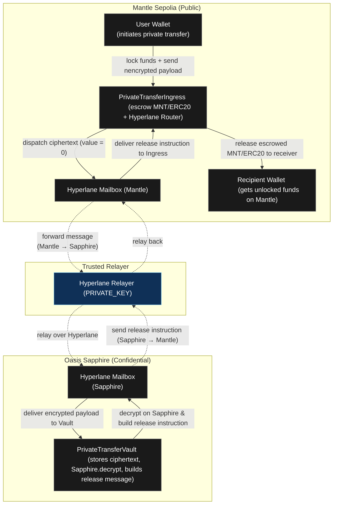

# Private Transfer on Mantle Sepolia (Hyperlane + Oasis Sapphire)

This repository contains an end‑to‑end demo of a private transfer built on:

- **Mantle Sepolia** – runs `PrivateTransferIngress.sol`, which escrows native MNT/USDC and forwards encrypted payloads through Hyperlane’s Mailbox.
- **Oasis Sapphire Testnet** – runs `PrivateTransferVault.sol`, which decrypts the payload via `Sapphire.decrypt`, decides who should receive the funds, and relays a release instruction back to Mantle.
- **TrustedRelayer ISM** – an `IInterchainSecurityModule` that restricts inbound processing to your own Hyperlane relayer key.
- **Typescript/Hardhat scripts** to deploy contracts, enroll routers, start encrypted transfers, and complete the acknowledgement leg.

Follow the sections below to reproduce the flow and send a private transfer from Mantle to Sapphire and back.

---

## 1. Prerequisites

- Node.js ≥ 18 (Hardhat prints a warning on Node 23.x, but everything still works).
- `pnpm` (or npm/yarn) for installing dependencies.
- Funded accounts:
  - **Deployer/Relayer** (`PRIVATE_KEY`): pays for all deployments on both chains and runs the Hyperlane relayer.
  - **Optional tester** (`TESTER_PRIVATE_KEY` or `PRIVATE_KEY_2`): used only when calling `requestTransfer.ts` to simulate a different sender.

Install dependencies:

```bash
npm install
```

---

## 2. Environment Variables

Create `.env` (or export variables before running scripts). Common fields:

```ini
# RPC endpoints
MANTLE_SEPOLIA_RPC=https://rpc.sepolia.mantle.xyz
SAPPHIRE_TESTNET_RPC=https://testnet.sapphire.oasis.dev

# Primary signer (deployer + relayer)
PRIVATE_KEY=0xaaaaaaaaaaaaaaaaaaaaaaaaaaaaaaaaaaaaaaaaaaaaaaaaaaaaaaaaaaaaaaaa

# Dedicated sender for requestTransfer.ts
TESTER_PRIVATE_KEY=0xbbbbbbbbbbbbbbbbbbbbbbbbbbbbbbbbbbbbbbbbbbbbbbbbbbbbbbbbbbbbb

# Trusted Relayer Address For Deploy TrustedRelayerISM.sol
TRUSTED_RELAYER=0xyouraddress

# Hyperlane Mailbox Config
MANTLE_MAILBOX=0xE495652b291B836334465680156Ce50a100aF52f
SAPPHIRE_MAILBOX=0x79d3ECb26619B968A68CE9337DfE016aeA471435
MANTLE_DOMAIN=5003
SAPPHIRE_DOMAIN=23295

# API KEY for Verifying Contract
MANTLESCAN_API_KEY=xxx
SAPPHIRE_EXPLORER_API_KEY=yyy

# Contract Address Config
INGRESS_ADDRESS=0xIngressAddy
VAULT_ADDRESS=0xVaultAddy
ROUTER_ADDRESS=0xRouterAddy<Same as INGRESS_ADDRESS>
ISM_ADDRESS=0xISMAddy
VAULT_PUBLIC_KEY=0xVaultPubKey<Generate From VAULT_ADDRES>

# Tester Onchain Config
RECEIVER=0xReceiverAddy
AMOUNT=<Transfer Amount>
TOKEN_TYPE=<two options "native", "erc20"> 
TOKEN_ADDRESS=0xAcab8129E2cE587fD203FD770ec9ECAFA2C88080  #usdc addy on mantle sepolia testnet
TOKEN_DECIMALS=<two options "18" for native "6" for usdc>
DISPATCH_GAS_FEE=0.0005
TRANSFER_ID=<Fill this after u run script requestTransfer.ts>
PRIVATE_MEMO="gm" #OPTIONAL

```

You can override any variable inline when running a script.

---

## 3. Build & Compile

```bash
npx hardhat compile
```

---

## 3.1 Architecture Diagram

Berikut diagram arsitektur high‑level dari alur private transfer (Mantle → Sapphire → Mantle) menggunakan Hyperlane:



---

## 4. Deployment Flow (Mantle + Sapphire)

### 4.1 Deploy contracts

```bash
# Mantle Ingress (escrow + Hyperlane client)
npx hardhat run scripts/privatetransfer/deploy/deployIngress.ts --network mantleSepolia

# Sapphire Vault (decrypt + release)
npx hardhat run scripts/privatetransfer/deploy/deployVault.ts --network sapphireTestnet

# TrustedRelayer ISM (Mantle only)
# MANTLE_MAILBOX= TRUSTED_RELAYER= fill this env before running deployISM script
npx hardhat run scripts/privatetransfer/deploy/deployISM.ts --network mantleSepolia
```

Save the addy and the printed `vaultPublicKey` and set to env. Later scripts need them.

### 4.2 Enroll Hyperlane routers

```bash
# Mantle → Sapphire route
# INGRESS_ADDRESS= SAPPHIRE_DOMAIN= Ensure u have set this env 
npx hardhat run scripts/privatetransfer/enroll/enrollIngress.ts --network mantleSepolia

# Sapphire → Mantle route
# VAULT_ADDRESS=  MANTLE_DOMAIN= Ensure u have set this env 
npx hardhat run scripts/privatetransfer/enroll/enrollVault.ts --network sapphireTestnet

# Register ISM on Ingress
# ROUTER_ADDRESS= ISM_ADDRESS= Ensure u have set this env 
npx hardhat run scripts/privatetransfer/enroll/registerIsm.ts --network mantleSepolia
```

### 4.3 Fetch Vault public key (if you redeploy)

```bash
# VAULT_ADDRESS= Ensure u have set this env 
npx hardhat run scripts/privatetransfer/service/getVaultPublicKey.ts --network sapphireTestnet
```

### 4.4 Run the Hyperlane relayer

From another terminal:

```bash
# export the env
export HYP_KEY='0xprivkey'

# Run the Relayer
hyperlane relayer --chains sapphiretestnet,mantlesepolia
```
Make Sure U Have Installed [Hyperlane CLI](https://docs.hyperlane.xyz/docs/reference/developer-tools/cli) 

The relayer will pay gas using the deployer key you provide.

---

## 5. Sending a Private Transfer (Deposit → Initiate)

Flow dua langkah: deposit bisa dipakai berkali-kali sampai saldo 0, lalu kirim instruksi terenkripsi.

### 5.1 Deposit (native / ERC20)
```bash
# native
npx hardhat run scripts/privatetransfer/service/deposit.ts --network mantleSepolia \
  --type native --amount 5 --ingress $INGRESS_ADDRESS --pk $SENDER_PK

# erc20
npx hardhat run scripts/privatetransfer/service/deposit.ts --network mantleSepolia \
  --type erc20 --token $TOKEN_ADDRESS --decimals 6 --amount 5 --ingress $INGRESS_ADDRESS --pk $SENDER_PK
```
Catat `DepositId` dari event `DepositCreated`. Satu depositId dapat dipakai beberapa kali sampai saldo habis.

### 5.2 Initiate transfer (hanya encrypted instructions)
```bash
INGRESS_ADDRESS=...
VAULT_PUBLIC_KEY=0x...32bytes
RECEIVER=0xReceiver
AMOUNT=2
TOKEN_TYPE=native        # atau erc20
TOKEN_DECIMALS=18        # atau sesuai token
DEPOSIT_ID=<DepositId_dari_step_5.1>
npx hardhat run scripts/privatetransfer/service/requestTransfer.ts --network mantleSepolia
```

Apa yang terjadi:
1. Off-chain pre-check: depositId harus milik pengirim, belum released, token/type cocok, dan saldo deposit >= AMOUNT.
2. Enkripsi `{receiver, token, amount, isNative, memo}` (X25519 + Deoxys-II).
3. Dispatch ciphertext ke Sapphire via Hyperlane (value 0; relayer/IGP bayar gas).
4. Cetak `encryptedDataHash` dan lookup `TRANSFER_ID` via `getTransferIdByCiphertextHash`.

You can check the status on Sapphire:

```bash
# VAULT_ADDRESS=<SAPPHIRE_VAULT> \
# TRANSFER_ID=0x<TRANSFER_ID_FROM_SCRIPT>
# Ensure U have set the ENV and then run the script
npx hardhat run scripts/privatetransfer/service/checkTransfer.ts --network sapphireTestnet
```

Once `Transfer exists: true` and `Already processed: false`, you can acknowledge it.

---

## 6. Acknowledging & Releasing Funds

Call `processTransfer` on Sapphire to decrypt and forward the release instruction back to Mantle:

```bash
# VAULT_ADDRESS=<SAPHIRE_VAULT>
# TRANSFER_ID=0x<TRANSFER_ID> 
# Ensure U have set the ENV and then run the script
npx hardhat run scripts/privatetransfer/service/ackTransfer.ts --network sapphireTestnet
```

- The script prints the Sapphire tx hash (look for `PrivatePayloadProcessed`).

After the relayer finishes, funds will be **directly transferred** to the receiver (persis seperti Umbra - tidak ada withdrawal).

**Important**: Event logs in Mantle now only emit **encrypted data hash**, making transactions look like **encrypted instructions** (persis seperti Umbra). This creates minimal on-chain footprint, exactly like Umbra's approach where only encrypted instructions are visible on the public chain. All computation happens in Oasis (confidential), just like Umbra uses Arcium for confidential computation.

**Pattern:**
- ✅ Mantle: Hanya encrypted instructions hash (minimal footprint)
- ✅ Oasis: Computation di confidential environment (Sapphire.decrypt)
- ✅ Event logs: Hanya `EncryptedInstructionsReceived` dan `EncryptedInstructionsProcessed`
- ✅ Privacy: Tidak ada data sensitif yang terlihat di Mantle
- ✅ Transfer: Langsung transfer ke receiver (persis seperti Umbra - tidak ada withdrawal)

**Kenapa kita pakai Sapphire?**
- Karena cross-chain, kita perlu trusted party (Vault owner) untuk decrypt dan build release instruction
- User bisa decrypt sendiri untuk verify (optional) - lihat `WHY_SAPPHIRE_AND_USER_DECRYPT.md` untuk detail

---

## 7. Private Lending PoC (Mantle + Sapphire, Umbra-style)

### 7.0 Architecture Diagram

Berikut diagram arsitektur high-level dari alur private lending (Mantle → Sapphire → Mantle) menggunakan Hyperlane:

```mermaid
flowchart TD
    classDef chain fill:#1a1a1a,stroke:#888,color:#fff
    classDef relay fill:#0f3057,stroke:#89cff0,color:#fff
    classDef confidential fill:#2d5016,stroke:#4a9b2f,color:#fff
    classDef action fill:#4a148c,stroke:#9c27b0,color:#fff

    subgraph Mantle["Mantle Sepolia (Public Chain)"]
        User["👤 User Wallet<br/>(Submit Actions)"]:::chain
        Ingress["PrivateLendingIngress<br/>(Escrow Funds +<br/>Hyperlane Router)"]:::chain
        MailboxM["Hyperlane Mailbox<br/>(Mantle)"]:::chain
        Receiver["💰 User Wallet<br/>(Receive Funds)"]:::chain
        Adapter["Adapter Contract<br/>(Optional - for DeFi)"]:::chain
    end

    subgraph Hyperlane["Hyperlane Relayer"]
        Relayer["Hyperlane Relayer<br/>(PRIVATE_KEY)"]:::relay
    end

    subgraph Sapphire["Oasis Sapphire (Confidential EVM)"]
        MailboxS["Hyperlane Mailbox<br/>(Sapphire)"]:::chain
        LendingCore["LendingCore<br/>(Decrypt Actions,<br/>Manage Positions,<br/>Calculate HF,<br/>Accrue Interest)"]:::confidential
        Oracle["ROFL Oracle<br/>(Price Feeds)"]:::confidential
    end

    subgraph Actions["Encrypted Actions"]
        Supply["SUPPLY<br/>(Deposit Collateral)"]:::action
        Borrow["BORROW<br/>(Borrow with Collateral)"]:::action
        Repay["REPAY<br/>(Pay Back Loan)"]:::action
        Withdraw["WITHDRAW<br/>(Withdraw Collateral)"]:::action
        Liquidate["LIQUIDATE<br/>(Liquidate Position)"]:::action
    end

    %% User submits action
    User -->|"1. Deposit Funds<br/>(Native/ERC20)"| Ingress
    User -->|"2. Submit Encrypted Action<br/>(Ciphertext Hash Only)"| Ingress
    
    %% Ingress escrows and dispatches
    Ingress -->|"3. Escrow Funds<br/>(Amount Visible)"| Ingress
    Ingress -->|"4. Dispatch Encrypted Payload<br/>(Value = 0, Ciphertext Only)"| MailboxM
    
    %% Hyperlane relay
    MailboxM -. "5. Forward Message<br/>(Mantle → Sapphire)" .-> Relayer
    Relayer -. "6. Relay over Hyperlane" .-> MailboxS
    
    %% Sapphire receives and processes
    MailboxS -->|"7. Deliver Encrypted Action"| LendingCore
    LendingCore -->|"8. Query Price"| Oracle
    Oracle -->|"9. Return Price Data"| LendingCore
    
    %% LendingCore processes action
    LendingCore -->|"10. Decrypt Payload<br/>(Sapphire.decrypt)"| LendingCore
    LendingCore -->|"11. Update Position<br/>(Private State)"| LendingCore
    LendingCore -->|"12. Calculate Health Factor<br/>(Confidential)"| LendingCore
    LendingCore -->|"13. Accrue Interest<br/>(Compound-style)"| LendingCore
    
    %% Release instruction back to Mantle
    LendingCore -->|"14. Build Release Instruction<br/>(If BORROW/WITHDRAW/LIQUIDATE)"| MailboxS
    MailboxS -. "15. Send Release Instruction<br/>(Sapphire → Mantle)" .-> Relayer
    Relayer -. "16. Relay back" .-> MailboxM
    
    %% Mantle releases funds
    MailboxM -->|"17. Deliver Release Instruction"| Ingress
    Ingress -->|"18. Release Escrowed Funds<br/>(To User/Adapter)"| Receiver
    
    %% Optional adapter flow
    Receiver -. "19. Optional: Execute<br/>on DeFi Protocol" .-> Adapter
    
    %% Action types
    Actions -. "Action Types" .-> User

    %% Privacy annotations
    Ingress -. "🔒 Privacy:<br/>Only Ciphertext Hash<br/>Visible on Mantle" .-> Ingress
    LendingCore -. "🔒 Privacy:<br/>Position Amounts Private<br/>Only Hash in Events" .-> LendingCore
    Oracle -. "🔒 Privacy:<br/>Price Updates Private" .-> Oracle

    %% Styling
    style Mantle fill:#1a1a1a,stroke:#888,stroke-width:2px
    style Sapphire fill:#2d5016,stroke:#4a9b2f,stroke-width:2px
    style Hyperlane fill:#0f3057,stroke:#89cff0,stroke-width:2px
    style Actions fill:#4a148c,stroke:#9c27b0,stroke-width:2px
```



**Catatan Arsitektur**:
- **Mantle (Public)**: Hanya melihat encrypted payload hash, tidak bisa melihat action type, amount, atau receiver
- **Sapphire (Confidential)**: Decrypt payload, manage positions secara private, calculate health factors
- **Privacy**: Position amounts 100% private - hanya hash yang terlihat di event logs
- **ROFL Oracle**: Price feeds di Sapphire untuk health factor calculation
- **Hyperlane**: Cross-chain messaging antara Mantle dan Sapphire

Private Lending Protocol yang memungkinkan user untuk:
- **Supply** collateral secara private (amount tidak terlihat di Mantle)
- **Borrow** dengan collateral sebagai jaminan
- **Repay** pinjaman
- **Withdraw** collateral
- **Liquidation** untuk posisi yang tidak sehat

Semua posisi (collateral & borrow amounts) **100% private** - hanya hash yang terlihat di event logs.

### 7.1 Architecture

Kontrak:
- **Mantle**: `PrivateLendingIngress` (escrow funds + dispatch encrypted actions via Hyperlane)
- **Sapphire**: `LendingCore` (decrypt actions, manage positions privately, calculate health factors, accrue interest)
- **ISM**: `TrustedRelayerIsm` (deploy di Mantle, reusable)

**Privacy Features**:
- ✅ Action payload terenkripsi (receiver, amount, token, action type) - hanya ciphertext hash terlihat di Mantle
- ✅ Position amounts **tidak terlihat** di event logs - hanya `positionHash` yang di-emit
- ✅ Health factor calculation terjadi di Sapphire (confidential)
- ✅ Interest accrual terjadi di Sapphire (confidential)

### 7.2 Environment Variables

Env tambahan (di luar env private transfer):
```ini
# Contract Addresses
INGRESS_ADDRESS=0x...         # PrivateLendingIngress (Mantle)
CORE_ADDRESS=0x...            # LendingCore (Sapphire)
LENDING_PUBLIC_KEY=0x...32bytes  # Public key dari LendingCore untuk encryption

# Hyperlane Domains
MANTLE_DOMAIN=5003
SAPPHIRE_DOMAIN=23295

# Token Config
TOKEN_TYPE=native|erc20
TOKEN_ADDRESS=0x...           # wajib kalau erc20
TOKEN_DECIMALS=18|6

# Action Parameters
AMOUNT=1.0
DEPOSIT_ID=0x...              # untuk borrow/repay/withdraw (harus deposit dulu)
ON_BEHALF=0x...               # optional (default: sender address)
ACTION_ID=0x...                # untuk processAction (dari event EncryptedActionReceived)
DISPATCH_GAS_FEE=0            # optional value saat dispatch
PRIVATE_MEMO="optional"
```

### 7.3 Deployment

**📖 Lihat [DEPLOYMENT_FLOW.md](./DEPLOYMENT_FLOW.md) untuk panduan deployment lengkap step-by-step dengan testing end-to-end.**

Deploy PoC (ringkas):
```bash
# 1. Deploy Contracts
MANTLE_MAILBOX=0x... npx hardhat run scripts/privatelending/deploy/deployIngress.ts --network mantleSepolia
SAPPHIRE_MAILBOX=0x... npx hardhat run scripts/privatelending/deploy/deployLendingCore.ts --network sapphireTestnet
MANTLE_MAILBOX=0x... TRUSTED_RELAYER=0x... npx hardhat run scripts/privatelending/deploy/deployISM.ts --network mantleSepolia

# 2. Enroll Routers
INGRESS_ADDRESS=0x... CORE_ADDRESS=0x... SAPPHIRE_DOMAIN=23295 \
  npx hardhat run scripts/privatelending/enroll/enrollIngress.ts --network mantleSepolia
CORE_ADDRESS=0x... INGRESS_ADDRESS=0x... MANTLE_DOMAIN=5003 \
  npx hardhat run scripts/privatelending/enroll/enrollLendingCore.ts --network sapphireTestnet

# 3. Register ISM
ROUTER_ADDRESS=0x... ISM_ADDRESS=0x... \
  npx hardhat run scripts/privatelending/enroll/registerIsm.ts --network mantleSepolia

# 4. Configure Token (WAJIB sebelum bisa digunakan)
npx hardhat console --network sapphireTestnet
> const core = await ethers.getContractAt("LendingCore", "0x...")
> await core.configureToken(
    "0xTOKEN",      // token address
    7500,           // LTV (75%)
    8000,           // liquidation threshold (80%)
    1000,           // borrow rate (10% APR, dalam bps)
    500             // supply rate (5% APR, dalam bps)
  )

# 5. Setup Oracle (ROFL Oracle - Recommended, atau Manual Update untuk Testing)
# Option A: ROFL Oracle (Production)
CORE_ADDRESS=0x... TOKEN_ADDRESS=0x... ROFL_ORACLE_ADDRESS=0x... \
  npx hardhat run scripts/privatelending/service/setRoflOracle.ts --network sapphireTestnet
CORE_ADDRESS=0x... TOKEN_ADDRESS=0x... \
  npx hardhat run scripts/privatelending/service/updatePriceFromRoflOracle.ts --network sapphireTestnet

# Option B: Manual Update (Testing)
CORE_ADDRESS=0x... TOKEN_ADDRESS=0x... MANUAL_PRICE=1.0 \
  npx hardhat run scripts/privatelending/service/updatePrice.ts --network sapphireTestnet
```

### 7.4 Usage Flow

**Setelah deployment & setup oracle**, ikuti flow berikut:

#### 7.4.1 Supply (Deposit Collateral)

```bash
TOKEN_TYPE=native TOKEN_DECIMALS=18 AMOUNT=1 \
LENDING_PUBLIC_KEY=0x... \
INGRESS_ADDRESS=0x... \
npx hardhat run scripts/privatelending/service/supply.ts --network mantleSepolia
```

**Output**: `ACTION_ID` - catat untuk process di Sapphire.

#### 7.4.2 Process Action di Sapphire

Setelah submit action, **WAJIB process di Sapphire**:

```bash
CORE_ADDRESS=0x... ACTION_ID=0x... \
npx hardhat run scripts/privatelending/service/processAction.ts --network sapphireTestnet
```

**Catatan**: 
- Script ini akan decrypt payload, update position, calculate health factor, dan dispatch release instruction (jika perlu)
- Untuk borrow/withdraw, release instruction akan dikirim ke Mantle via Hyperlane
- Relayer akan forward message, dan user akan menerima funds di Mantle

#### 7.4.3 Borrow (Pakai Deposit ID dari Supply)

```bash
DEPOSIT_ID=0x... TOKEN_TYPE=native TOKEN_DECIMALS=18 AMOUNT=0.5 \
LENDING_PUBLIC_KEY=0x... \
INGRESS_ADDRESS=0x... \
npx hardhat run scripts/privatelending/service/borrow.ts --network mantleSepolia
```

**Catatan**: 
- `DEPOSIT_ID` harus dari deposit sebelumnya (bisa dari supply atau deposit terpisah)
- Health factor akan di-check di Sapphire saat processAction
- Jika HF < 1.0, borrow akan gagal

#### 7.4.4 Repay (Bayar Pinjaman)

**Deposit dulu untuk repay**:
```bash
TOKEN_TYPE=native TOKEN_DECIMALS=18 AMOUNT=0.2 \
INGRESS_ADDRESS=0x... \
npx hardhat run scripts/privatetransfer/service/deposit.ts --network mantleSepolia \
  --type native --amount 0.2 --ingress $INGRESS_ADDRESS
```

**Lalu submit repay action**:
```bash
DEPOSIT_ID=0x... TOKEN_TYPE=native TOKEN_DECIMALS=18 AMOUNT=0.2 \
LENDING_PUBLIC_KEY=0x... \
INGRESS_ADDRESS=0x... \
npx hardhat run scripts/privatelending/service/repay.ts --network mantleSepolia
```

#### 7.4.5 Withdraw (Tarik Collateral)

```bash
DEPOSIT_ID=0x... TOKEN_TYPE=native TOKEN_DECIMALS=18 AMOUNT=0.3 \
LENDING_PUBLIC_KEY=0x... \
INGRESS_ADDRESS=0x... \
npx hardhat run scripts/privatelending/service/withdraw.ts --network mantleSepolia
```

**Catatan**: 
- Health factor akan di-check setelah withdraw
- Jika HF < 1.0 setelah withdraw, action akan gagal

### 7.5 Check Position & Health Factor

```bash
npx hardhat console --network sapphireTestnet
> const core = await ethers.getContractAt("LendingCore", "0x...")
> const pos = await core.positions("0xUSER_ADDRESS", "0xTOKEN_ADDRESS")
> console.log("Collateral:", pos.collateral.toString())
> console.log("Borrow:", pos.borrow.toString())
> const hf = await core.calculateHealthFactorForToken("0xUSER_ADDRESS", "0xTOKEN_ADDRESS")
> console.log("Health Factor:", hf.toString())  // 1e18 = 1.0
```

**Catatan**: 
- Position amounts **tidak terlihat** di event logs - hanya `positionHash`
- User bisa verify position hash via `computePositionHash(user, token)`
- Lihat [PRIVACY_POSITION_EVENTS.md](./PRIVACY_POSITION_EVENTS.md) untuk detail privacy

### 7.6 Important Notes

**⚠️ PENTING**:
- **Token config WAJIB**: Setiap token harus di-configure dulu via `configureToken()` sebelum bisa digunakan (sama seperti Aave)
  - LTV, liquidation threshold, borrow rate, supply rate harus di-set
  - Tanpa config, token tidak bisa digunakan - akan revert dengan "token not enabled"
- **Oracle**: 
  - **ROFL Oracle** adalah solusi yang direkomendasikan untuk Oasis Sapphire (lihat [Oasis Docs](https://docs.oasis.io/build/use-cases/price-oracle/))
  - Untuk testing, bisa pakai manual update via `updatePrice.ts`
  - Price harus di-update sebelum borrow/withdraw (untuk health factor calculation)
- **Deposit ID**: 
  - Harus milik pengirim; skrip melakukan pre-check dasar
  - Bisa dipakai berkali-kali sampai saldo habis (partial consumption)
- **ERC20**: 
  - Set `TOKEN_TYPE=erc20`, `TOKEN_ADDRESS`, `TOKEN_DECIMALS` sesuai token
  - Pastikan token sudah di-approve ke `INGRESS_ADDRESS`
- **Health Factor**: 
  - Harus >= 1.0 untuk bisa borrow/withdraw
  - Jika HF < 1.0, posisi bisa diliquidate
- **Privacy**: 
  - Position amounts **100% private** - hanya hash di event logs
  - Action payload terenkripsi - hanya ciphertext hash terlihat di Mantle
  - Lihat [PRIVACY_POSITION_EVENTS.md](./PRIVACY_POSITION_EVENTS.md) untuk detail

**📚 Dokumentasi Lengkap**:
- [DEPLOYMENT_FLOW.md](./DEPLOYMENT_FLOW.md) - Panduan deployment lengkap dengan testing end-to-end
- [TESTING_FLOW.md](./TESTING_FLOW.md) - Flow testing lengkap
- [PRIVATE_LENDING_FLOW.md](./PRIVATE_LENDING_FLOW.md) - Flow detail dan troubleshooting
- [PRIVACY_POSITION_EVENTS.md](./PRIVACY_POSITION_EVENTS.md) - Penjelasan privacy events

---

## 8. Optional: Multiple Tester Accounts

`requestTransfer.ts` memilih wallet dari env (prioritas):
1. `TESTER_PRIVATE_KEY`
2. `PRIVATE_KEY_2`
3. `SENDER_PRIVATE_KEY`
4. `PRIVATE_KEY` (fallback)

---

## 9. Troubleshooting

| Symptom | Likely cause | Fix |
| --- | --- | --- |
| `transfer missing` in `checkTransfer.ts` | Relayer belum relay pesan | Pastikan relayer aktif, cek log `Observed message ...`. |
| `decrypt: failed (error code 8)` | Vault key tidak cocok atau envelope double‑encoded | Pastikan `VAULT_PUBLIC_KEY` terbaru, jangan ubah format envelope. |
| `protocol fee / unable to send value` saat ack | Mailbox Mantle punya hook yang menolak value ≠ 0 | Jalankan tanpa hook (value 0) atau pasang Interchain Gas Paymaster & kirim `ACK_GAS_FEE`. |
| `transfer missing` pada Mantle setelah ack | Kamu redeploy Ingress setelah escrow, jadi state lamanya hilang | Selesaikan transfer sebelum redeploy, atau refund manual dari kontrak lama. |

---

## 10. References

### Private Transfer
- Oasis Sapphire encrypted tx & local testing [[1]](https://docs.oasis.io/build/sapphire/develop/testing#ethers)
- Hyperlane Mailbox, hooks & ISMs [[2]](https://docs.hyperlane.xyz/docs/guides/create-custom-hook-and-ism), [[3]](https://docs.hyperlane.xyz/docs/protocol/core/mailbox)
- Hyperlane fee model & Interchain Gas Paymaster [[4]](https://docs.hyperlane.xyz/docs/protocol/core/fees), [[5]](https://docs.hyperlane.xyz/docs/protocol/core/interchain-gas-payment)

### Private Lending
- Oasis ROFL Price Oracle [[6]](https://docs.oasis.io/build/use-cases/price-oracle/)
- ROFL Price Oracle Example [[7]](https://github.com/oasisprotocol/demo-rofl)
- Oasis Sapphire Docs [[8]](https://docs.oasis.io/build/sapphire/)
- Hyperlane Docs [[9]](https://docs.hyperlane.xyz/)

Dengan alur ini, data sensitif (alamat penerima, jumlah, memo) hanya pernah muncul dalam bentuk terenkripsi di Mantle. Dekripsi dan keputusan akhir sepenuhnya terjadi di Sapphire melalui `Sapphire.decrypt`, sehingga Anda mendapatkan privacy layer ala Oasis di atas Hyperlane. Selamat bereksperimen! 🚀
