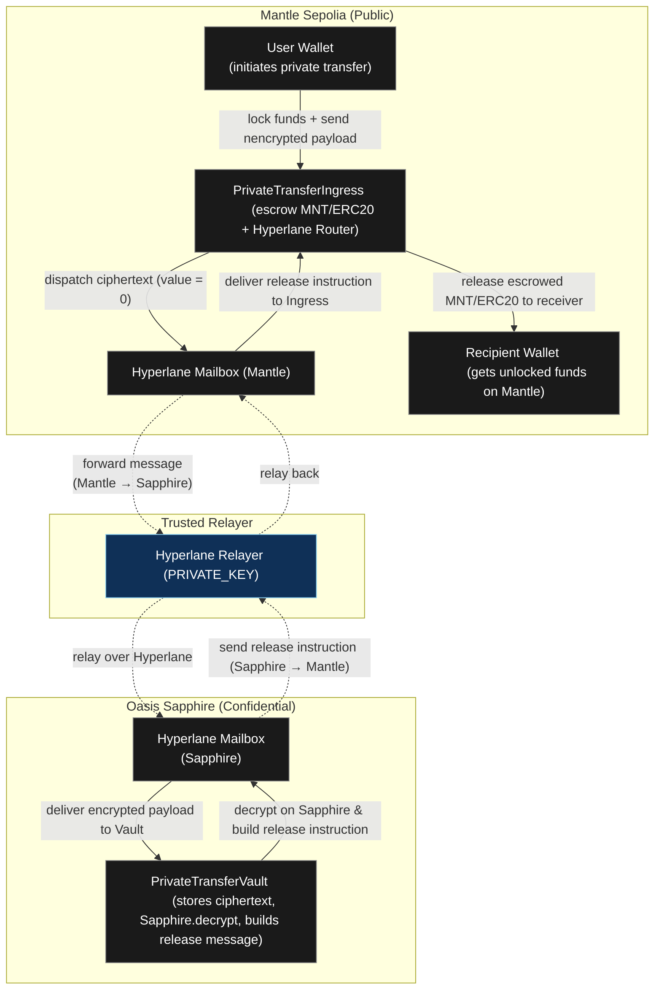

# Private Transfer on Mantle Sepolia (Hyperlane + Oasis Sapphire)

This repository contains an end‑to‑end demo of a private transfer built on:

- **Mantle Sepolia** – runs `PrivateTransferIngress.sol`, which escrows native MNT/USDC and forwards encrypted payloads through Hyperlane’s Mailbox.
- **Oasis Sapphire Testnet** – runs `PrivateTransferVault.sol`, which decrypts the payload via `Sapphire.decrypt`, decides who should receive the funds, and relays a release instruction back to Mantle.
- **TrustedRelayer ISM** – an `IInterchainSecurityModule` that restricts inbound processing to your own Hyperlane relayer key.
- **Typescript/Hardhat scripts** to deploy contracts, enroll routers, start encrypted transfers, and complete the acknowledgement leg.

Follow the sections below to reproduce the flow and send a private transfer from Mantle to Sapphire and back.

---

## 1. Prerequisites

- Node.js ≥ 18 (Hardhat prints a warning on Node 23.x, but everything still works).
- `pnpm` (or npm/yarn) for installing dependencies.
- Funded accounts:
  - **Deployer/Relayer** (`PRIVATE_KEY`): pays for all deployments on both chains and runs the Hyperlane relayer.
  - **Optional tester** (`TESTER_PRIVATE_KEY` or `PRIVATE_KEY_2`): used only when calling `requestTransfer.ts` to simulate a different sender.

Install dependencies:

```bash
npm install
```

---

## 2. Environment Variables

Create `.env` (or export variables before running scripts). Common fields:

```ini
# RPC endpoints
MANTLE_SEPOLIA_RPC=https://rpc.sepolia.mantle.xyz
SAPPHIRE_TESTNET_RPC=https://testnet.sapphire.oasis.dev

# Primary signer (deployer + relayer)
PRIVATE_KEY=0xaaaaaaaaaaaaaaaaaaaaaaaaaaaaaaaaaaaaaaaaaaaaaaaaaaaaaaaaaaaaaaaa

# Dedicated sender for requestTransfer.ts
TESTER_PRIVATE_KEY=0xbbbbbbbbbbbbbbbbbbbbbbbbbbbbbbbbbbbbbbbbbbbbbbbbbbbbbbbbbbbbb

# Trusted Relayer Address For Deploy TrustedRelayerISM.sol
TRUSTED_RELAYER=0xyouraddress

# Hyperlane Mailbox Config
MANTLE_MAILBOX=0xE495652b291B836334465680156Ce50a100aF52f
SAPPHIRE_MAILBOX=0x79d3ECb26619B968A68CE9337DfE016aeA471435
MANTLE_DOMAIN=5003
SAPPHIRE_DOMAIN=23295

# API KEY for Verifying Contract
MANTLESCAN_API_KEY=xxx
SAPPHIRE_EXPLORER_API_KEY=yyy

# Contract Address Config
INGRESS_ADDRESS=0xIngressAddy
VAULT_ADDRESS=0xVaultAddy
ROUTER_ADDRESS=0xRouterAddy<Same as INGRESS_ADDRESS>
ISM_ADDRESS=0xISMAddy
VAULT_PUBLIC_KEY=0xVaultPubKey<Generate From VAULT_ADDRES>

# Tester Onchain Config
RECEIVER=0xReceiverAddy
AMOUNT=<Transfer Amount>
TOKEN_TYPE=<two options "native", "erc20"> 
TOKEN_ADDRESS=0xAcab8129E2cE587fD203FD770ec9ECAFA2C88080  #usdc addy on mantle sepolia testnet
TOKEN_DECIMALS=<two options "18" for native "6" for usdc>
DISPATCH_GAS_FEE=0.0005
TRANSFER_ID=<Fill this after u run script requestTransfer.ts>
PRIVATE_MEMO="gm" #OPTIONAL

```

You can override any variable inline when running a script.

---

## 3. Build & Compile

```bash
npx hardhat compile
```

---

## 3.1 Architecture Diagram

Berikut diagram arsitektur high‑level dari alur private transfer (Mantle → Sapphire → Mantle) menggunakan Hyperlane:



---

## 4. Deployment Flow (Mantle + Sapphire)

### 4.1 Deploy contracts

```bash
# Mantle Ingress (escrow + Hyperlane client)
npx hardhat run scripts/privatetransfer/deploy/deployIngress.ts --network mantleSepolia

# Sapphire Vault (decrypt + release)
npx hardhat run scripts/privatetransfer/deploy/deployVault.ts --network sapphireTestnet

# TrustedRelayer ISM (Mantle only)
# MANTLE_MAILBOX= TRUSTED_RELAYER= fill this env before running deployISM script
npx hardhat run scripts/privatetransfer/deploy/deployISM.ts --network mantleSepolia
```

Save the addy and the printed `vaultPublicKey` and set to env. Later scripts need them.

### 4.2 Enroll Hyperlane routers

```bash
# Mantle → Sapphire route
# INGRESS_ADDRESS= SAPPHIRE_DOMAIN= Ensure u have set this env 
npx hardhat run scripts/privatetransfer/enroll/enrollIngress.ts --network mantleSepolia

# Sapphire → Mantle route
# VAULT_ADDRESS=  MANTLE_DOMAIN= Ensure u have set this env 
npx hardhat run scripts/privatetransfer/enroll/enrollVault.ts --network sapphireTestnet

# Register ISM on Ingress
# ROUTER_ADDRESS= ISM_ADDRESS= Ensure u have set this env 
npx hardhat run scripts/privatetransfer/enroll/registerIsm.ts --network mantleSepolia
```

### 4.3 Fetch Vault public key (if you redeploy)

```bash
# VAULT_ADDRESS= Ensure u have set this env 
npx hardhat run scripts/privatetransfer/service/getVaultPublicKey.ts --network sapphireTestnet
```

### 4.4 Run the Hyperlane relayer

From another terminal:

```bash
# export the env
export HYP_KEY='0xprivkey'

# Run the Relayer
hyperlane relayer --chains sapphiretestnet,mantlesepolia
```
Make Sure U Have Installed [Hyperlane CLI](https://docs.hyperlane.xyz/docs/reference/developer-tools/cli) 

The relayer will pay gas using the deployer key you provide.

---

## 5. Sending a Private Transfer

Use the helper script to escrow MNT/ERC‑20 and send an encrypted payload to Sapphire:

```bash

# INGRESS_ADDRESS=<MANTLE_INGRESS> 
# VAULT_PUBLIC_KEY=<VAULT_PUBLIC_KEY> 
# RECEIVER=0xRecipientOnMantle 
# AMOUNT=10 
# TOKEN_TYPE=native 
# TOKEN_DECIMALS=18 
# DISPATCH_GAS_FEE=0.0005 
# TESTER_PRIVATE_KEY=$TESTER_PRIVATE_KEY 
# Ensure U have set the ENV and then run the script
npx hardhat run scripts/privatetransfer/service/requestTransfer.ts --network mantleSepolia
```

What it does:

1. Locks the `AMOUNT` in `PrivateTransferIngress`.
2. Encrypts `{receiver, token, amount, isNative, memo}` using the Vault’s public key (X25519 + Deoxys-II).
3. Dispatches the ciphertext to Sapphire through the Hyperlane Mailbox (value always 0, relayer pays gas).
4. Prints the `TRANSFER_ID` and Mantle Tx hash.
5. Copy the TRANSFER_ID and set on env, if u do this again, as always update the `TRANSFER_ID`

You can check the status on Sapphire:

```bash
# VAULT_ADDRESS=<SAPPHIRE_VAULT> \
# TRANSFER_ID=0x<TRANSFER_ID_FROM_SCRIPT>
# Ensure U have set the ENV and then run the script
npx hardhat run scripts/privatetransfer/service/checkTransfer.ts --network sapphireTestnet
```

Once `Transfer exists: true` and `Already processed: false`, you can acknowledge it.

---

## 6. Acknowledging & Releasing Funds

Call `processTransfer` on Sapphire to decrypt and forward the release instruction back to Mantle:

```bash
# VAULT_ADDRESS=<SAPHIRE_VAULT>
# TRANSFER_ID=0x<TRANSFER_ID> 
# Ensure U have set the ENV and then run the script
npx hardhat run scripts/privatetransfer/service/ackTransfer.ts --network sapphireTestnet
```

- The script prints the Sapphire tx hash (look for `PrivatePayloadProcessed`).

After the relayer finishes, check Mantle’s Ingress events or re-run `checkTransfer.ts` pointing at the Mantle contract to confirm `released = true`.

---

## 7. Optional: Multiple Tester Accounts

`requestTransfer.ts` will automatically use these env variables (first match wins) to build a custom `ethers.Wallet` for the sender:

1. `TESTER_PRIVATE_KEY`
2. `PRIVATE_KEY_2`
3. `SENDER_PRIVATE_KEY`
4. Fallback: Hardhat’s default signer (`PRIVATE_KEY`)

That means you can run:

```bash
TESTER_PRIVATE_KEY=0xyour_test_account_pk \
INGRESS_ADDRESS=... \
VAULT_PUBLIC_KEY=... \
npx hardhat run scripts/privatetransfer/service/requestTransfer.ts --network mantleSepolia
```

without touching the deployer/relayer key.

---

## 8. Troubleshooting

| Symptom | Likely cause | Fix |
| --- | --- | --- |
| `transfer missing` in `checkTransfer.ts` | Relayer belum relay pesan | Pastikan relayer aktif, cek log `Observed message ...`. |
| `decrypt: failed (error code 8)` | Vault key tidak cocok atau envelope double‑encoded | Pastikan `VAULT_PUBLIC_KEY` terbaru, jangan ubah format envelope. |
| `protocol fee / unable to send value` saat ack | Mailbox Mantle punya hook yang menolak value ≠ 0 | Jalankan tanpa hook (value 0) atau pasang Interchain Gas Paymaster & kirim `ACK_GAS_FEE`. |
| `transfer missing` pada Mantle setelah ack | Kamu redeploy Ingress setelah escrow, jadi state lamanya hilang | Selesaikan transfer sebelum redeploy, atau refund manual dari kontrak lama. |

---

## 9. References

- Oasis Sapphire encrypted tx & local testing [[1]](https://docs.oasis.io/build/sapphire/develop/testing#ethers)
- Hyperlane Mailbox, hooks & ISMs [[2]](https://docs.hyperlane.xyz/docs/guides/create-custom-hook-and-ism), [[3]](https://docs.hyperlane.xyz/docs/protocol/core/mailbox)
- Hyperlane fee model & Interchain Gas Paymaster [[4]](https://docs.hyperlane.xyz/docs/protocol/core/fees), [[4]](https://docs.hyperlane.xyz/docs/protocol/core/interchain-gas-payment)

Dengan alur ini, data sensitif (alamat penerima, jumlah, memo) hanya pernah muncul dalam bentuk terenkripsi di Mantle. Dekripsi dan keputusan akhir sepenuhnya terjadi di Sapphire melalui `Sapphire.decrypt`, sehingga Anda mendapatkan privacy layer ala Oasis di atas Hyperlane. Selamat bereksperimen! 🚀
